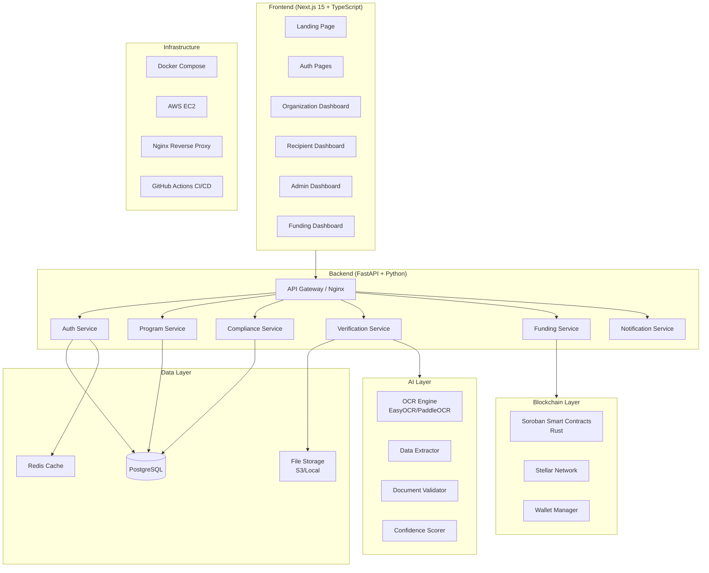
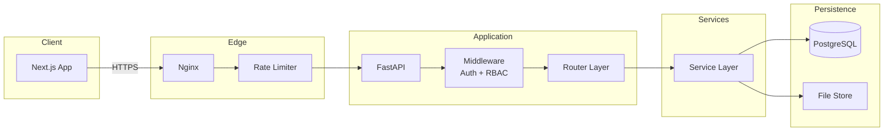
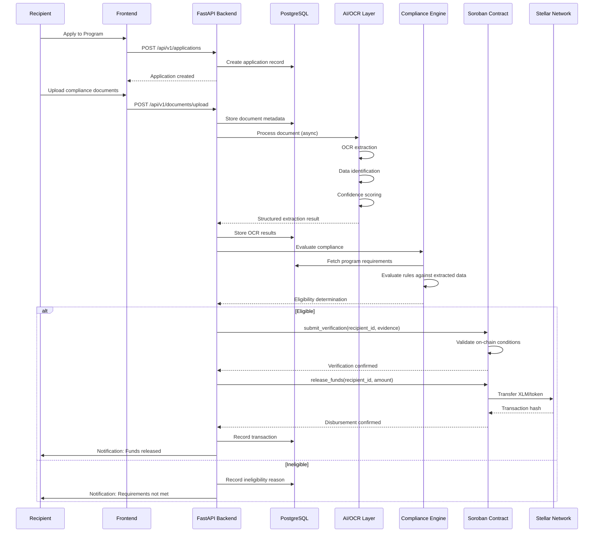
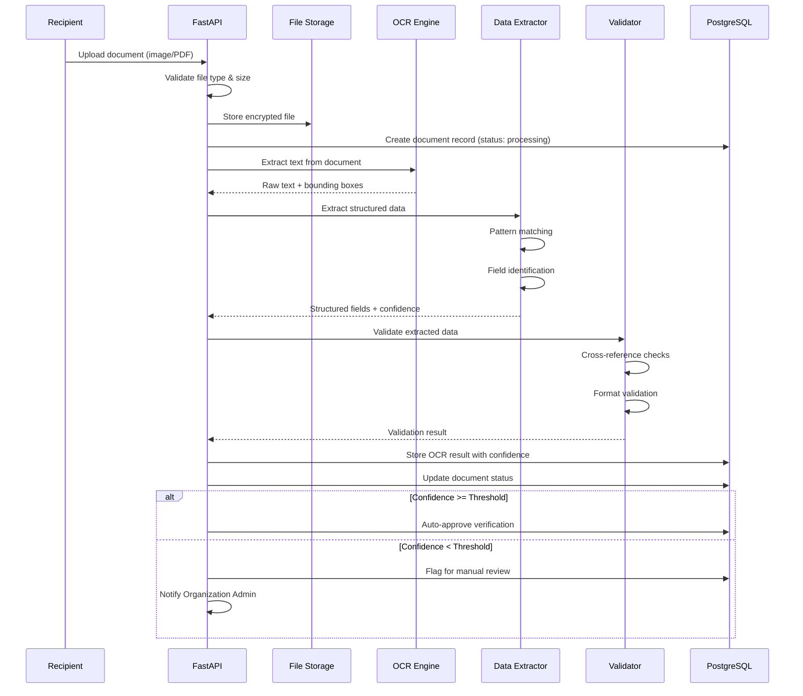
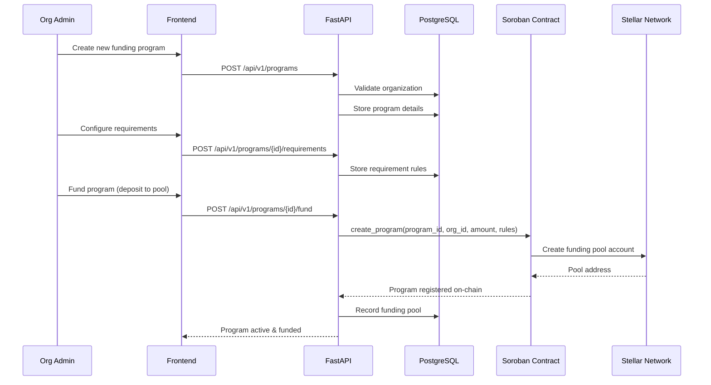
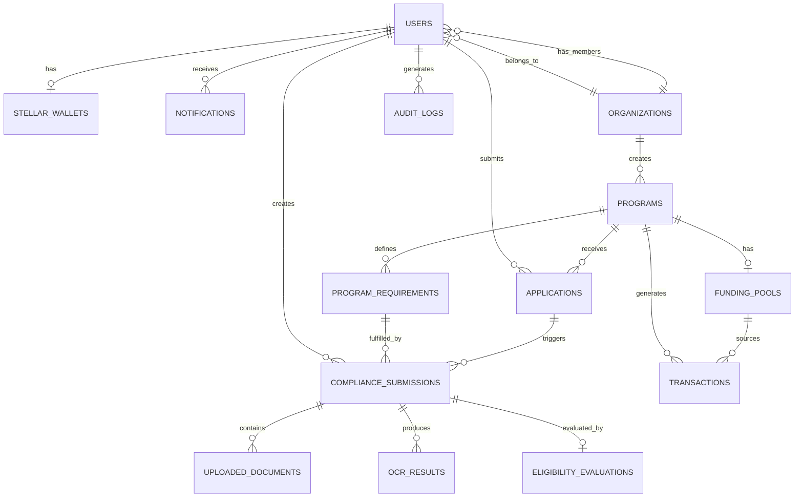
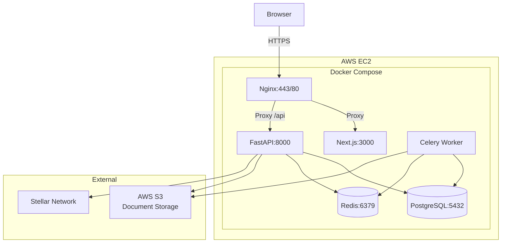
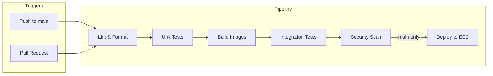

# Design Document: Merit Platform

## Overview

Merit is an AI-assisted conditional funding platform that automates the end-to-end lifecycle of financial assistance programs — from program creation and recipient application, through AI-powered document verification and compliance evaluation, to blockchain-based fund disbursement via Stellar/Soroban smart contracts.

The platform serves three primary user roles: Super Admins managing the platform, Organization Admins creating and overseeing funding programs, and Recipients applying for and receiving funding. The architecture is designed as a modular, event-driven system with clear separation between the verification layer (AI/OCR), the compliance engine (rule evaluation), and the disbursement layer (Soroban/Stellar), all orchestrated through a Python/FastAPI backend and consumed by a Next.js 15 frontend.

Merit eliminates manual verification bottlenecks and payment processing delays by establishing a transparent, auditable, automated funding pipeline where funds are released only when predefined conditions are programmatically verified and validated on-chain.

## Architecture

### System Overview



### Request Flow Architecture



## Sequence Diagrams

### Recipient Application & Funding Flow



### Document Verification Flow



### Organization Program Creation Flow



## Components and Interfaces

### Component 1: Authentication Service

**Purpose**: Manages user registration, login, JWT token lifecycle, password management, and role-based access control.

**Interface**:
```python
from pydantic import BaseModel, EmailStr
from enum import Enum
from typing import Optional
from datetime import datetime

class UserRole(str, Enum):
    SUPER_ADMIN = "super_admin"
    ORG_ADMIN = "org_admin"
    RECIPIENT = "recipient"

class RegisterRequest(BaseModel):
    email: EmailStr
    password: str
    full_name: str
    role: UserRole
    organization_id: Optional[str] = None

class LoginRequest(BaseModel):
    email: EmailStr
    password: str

class TokenResponse(BaseModel):
    access_token: str
    refresh_token: str
    token_type: str = "bearer"
    expires_in: int

class AuthService:
    async def register(self, request: RegisterRequest) -> UserResponse: ...
    async def login(self, request: LoginRequest) -> TokenResponse: ...
    async def refresh_token(self, refresh_token: str) -> TokenResponse: ...
    async def reset_password(self, email: EmailStr) -> None: ...
    async def change_password(self, user_id: str, old_password: str, new_password: str) -> None: ...
    async def verify_token(self, token: str) -> TokenPayload: ...
    async def get_current_user(self, token: str) -> UserResponse: ...
```

**Responsibilities**:
- Secure password hashing (bcrypt)
- JWT access/refresh token generation and validation
- Role-based permission enforcement
- Session management via Redis
- Rate limiting on auth endpoints

### Component 2: Program Service

**Purpose**: Manages funding program lifecycle including creation, configuration, requirement definition, and status management.

**Interface**:
```python
class ProgramStatus(str, Enum):
    DRAFT = "draft"
    ACTIVE = "active"
    PAUSED = "paused"
    COMPLETED = "completed"
    ARCHIVED = "archived"

class RequirementType(str, Enum):
    ACADEMIC_GWA = "academic_gwa"
    ENROLLMENT_STATUS = "enrollment_status"
    DOCUMENT_SUBMISSION = "document_submission"
    MILESTONE_COMPLETION = "milestone_completion"
    ATTENDANCE = "attendance"
    CUSTOM = "custom"

class ProgramRequirement(BaseModel):
    requirement_type: RequirementType
    description: str
    condition_operator: str  # lte, gte, eq, contains, exists
    condition_value: str
    is_mandatory: bool = True
    verification_frequency: str  # once, per_semester, monthly

class CreateProgramRequest(BaseModel):
    name: str
    description: str
    organization_id: str
    funding_amount_per_recipient: float
    max_recipients: int
    requirements: list[ProgramRequirement]
    start_date: datetime
    end_date: Optional[datetime] = None

class ProgramService:
    async def create_program(self, request: CreateProgramRequest, admin_id: str) -> ProgramResponse: ...
    async def update_program(self, program_id: str, updates: UpdateProgramRequest) -> ProgramResponse: ...
    async def add_requirement(self, program_id: str, requirement: ProgramRequirement) -> None: ...
    async def remove_requirement(self, program_id: str, requirement_id: str) -> None: ...
    async def activate_program(self, program_id: str) -> ProgramResponse: ...
    async def pause_program(self, program_id: str) -> ProgramResponse: ...
    async def get_program(self, program_id: str) -> ProgramResponse: ...
    async def list_programs(self, org_id: Optional[str], status: Optional[ProgramStatus]) -> list[ProgramResponse]: ...
    async def get_program_analytics(self, program_id: str) -> ProgramAnalytics: ...
```

**Responsibilities**:
- Program CRUD operations
- Requirement configuration and validation
- Program status lifecycle management
- Analytics aggregation
- Organization-scoped access control

### Component 3: Verification Service

**Purpose**: Orchestrates document upload, OCR processing, data extraction, and confidence-based verification decisions.

**Interface**:
```python
class DocumentType(str, Enum):
    GRADE_SLIP = "grade_slip"
    ENROLLMENT_FORM = "enrollment_form"
    CERTIFICATE = "certificate"
    TRANSCRIPT = "transcript"
    ID_DOCUMENT = "id_document"
    REPORT = "report"
    CUSTOM = "custom"

class OCRResult(BaseModel):
    document_id: str
    extracted_text: str
    structured_data: dict  # e.g., {"gwa": 2.15, "student_id": "2023-12345"}
    confidence_score: float  # 0.0 to 1.0
    extraction_metadata: dict
    processing_time_ms: int

class VerificationStatus(str, Enum):
    PENDING = "pending"
    PROCESSING = "processing"
    AUTO_VERIFIED = "auto_verified"
    MANUAL_REVIEW = "manual_review"
    VERIFIED = "verified"
    REJECTED = "rejected"

class VerificationService:
    async def upload_document(self, file: UploadFile, recipient_id: str, document_type: DocumentType, submission_id: str) -> DocumentResponse: ...
    async def process_document(self, document_id: str) -> OCRResult: ...
    async def get_verification_status(self, document_id: str) -> VerificationStatus: ...
    async def manual_verify(self, document_id: str, admin_id: str, approved: bool, notes: str) -> None: ...
    async def get_ocr_result(self, document_id: str) -> OCRResult: ...
    async def reprocess_document(self, document_id: str) -> OCRResult: ...
```

**Responsibilities**:
- File upload validation (type, size, format)
- Async OCR processing pipeline
- Confidence threshold management
- Manual review queue management
- Document storage encryption

### Component 4: Compliance Engine

**Purpose**: Evaluates recipient eligibility against program requirements using configurable rule chains.

**Interface**:
```python
class EligibilityStatus(str, Enum):
    ELIGIBLE = "eligible"
    INELIGIBLE = "ineligible"
    PENDING_VERIFICATION = "pending_verification"
    PARTIAL = "partial"

class RuleEvaluationResult(BaseModel):
    requirement_id: str
    requirement_type: RequirementType
    condition: str
    actual_value: Optional[str]
    expected_value: str
    passed: bool
    reason: str

class ComplianceEvaluation(BaseModel):
    recipient_id: str
    program_id: str
    overall_status: EligibilityStatus
    rule_results: list[RuleEvaluationResult]
    evaluated_at: datetime
    next_evaluation_due: Optional[datetime]

class ComplianceEngine:
    async def evaluate_eligibility(self, recipient_id: str, program_id: str) -> ComplianceEvaluation: ...
    async def evaluate_single_requirement(self, recipient_id: str, requirement_id: str) -> RuleEvaluationResult: ...
    async def get_compliance_history(self, recipient_id: str, program_id: str) -> list[ComplianceEvaluation]: ...
    async def get_pending_requirements(self, recipient_id: str, program_id: str) -> list[ProgramRequirement]: ...
    async def trigger_batch_evaluation(self, program_id: str) -> BatchEvaluationResult: ...
```

**Responsibilities**:
- Rule parsing and evaluation
- Condition operator execution (lte, gte, eq, contains, exists)
- Rule chaining and dependency resolution
- Batch evaluation for program-wide compliance checks
- Evaluation scheduling

### Component 5: Funding Service

**Purpose**: Manages Stellar wallet operations, Soroban smart contract interactions, and fund disbursement.

**Interface**:
```python
class WalletInfo(BaseModel):
    wallet_id: str
    public_key: str
    network: str  # testnet or mainnet
    balance: float
    created_at: datetime

class DisbursementRequest(BaseModel):
    recipient_id: str
    program_id: str
    amount: float
    compliance_evaluation_id: str

class TransactionRecord(BaseModel):
    transaction_id: str
    stellar_tx_hash: str
    from_address: str
    to_address: str
    amount: float
    asset_code: str
    status: str
    created_at: datetime
    confirmed_at: Optional[datetime]

class FundingService:
    async def create_wallet(self, user_id: str) -> WalletInfo: ...
    async def get_wallet(self, user_id: str) -> WalletInfo: ...
    async def create_funding_pool(self, program_id: str, org_id: str, initial_amount: float) -> WalletInfo: ...
    async def deposit_to_pool(self, program_id: str, amount: float) -> TransactionRecord: ...
    async def disburse_funds(self, request: DisbursementRequest) -> TransactionRecord: ...
    async def get_transaction_history(self, user_id: Optional[str], program_id: Optional[str]) -> list[TransactionRecord]: ...
    async def get_pool_balance(self, program_id: str) -> float: ...
    async def pause_disbursements(self, program_id: str) -> None: ...
    async def resume_disbursements(self, program_id: str) -> None: ...
```

**Responsibilities**:
- Stellar keypair generation and management
- Soroban contract invocation
- Transaction submission and confirmation tracking
- Funding pool balance management
- Network selection (testnet/mainnet)

### Component 6: Notification Service

**Purpose**: Manages multi-channel notifications for system events.

**Interface**:
```python
class NotificationType(str, Enum):
    APPLICATION_RECEIVED = "application_received"
    DOCUMENT_VERIFIED = "document_verified"
    ELIGIBILITY_DETERMINED = "eligibility_determined"
    FUNDS_RELEASED = "funds_released"
    MANUAL_REVIEW_REQUIRED = "manual_review_required"
    PROGRAM_UPDATE = "program_update"

class NotificationService:
    async def send_notification(self, user_id: str, notification_type: NotificationType, payload: dict) -> None: ...
    async def get_notifications(self, user_id: str, unread_only: bool = False) -> list[Notification]: ...
    async def mark_as_read(self, notification_id: str) -> None: ...
    async def get_unread_count(self, user_id: str) -> int: ...
```

**Responsibilities**:
- In-app notification delivery
- Email notification dispatch (future)
- Notification preference management
- Unread count tracking

## Data Models

### User Model

```python
class User(Base):
    __tablename__ = "users"

    id: Mapped[uuid.UUID] = mapped_column(primary_key=True, default=uuid.uuid4)
    email: Mapped[str] = mapped_column(String(255), unique=True, nullable=False, index=True)
    password_hash: Mapped[str] = mapped_column(String(255), nullable=False)
    full_name: Mapped[str] = mapped_column(String(255), nullable=False)
    role: Mapped[UserRole] = mapped_column(SQLAlchemyEnum(UserRole), nullable=False)
    organization_id: Mapped[Optional[uuid.UUID]] = mapped_column(ForeignKey("organizations.id"), nullable=True)
    is_active: Mapped[bool] = mapped_column(default=True)
    is_verified: Mapped[bool] = mapped_column(default=False)
    created_at: Mapped[datetime] = mapped_column(default=func.now())
    updated_at: Mapped[datetime] = mapped_column(default=func.now(), onupdate=func.now())

    # Relationships
    organization: Mapped[Optional["Organization"]] = relationship(back_populates="members")
    stellar_wallet: Mapped[Optional["StellarWallet"]] = relationship(back_populates="user")
    notifications: Mapped[list["Notification"]] = relationship(back_populates="user")
```

**Validation Rules**:
- Email must be unique and valid format
- Password must be >= 8 characters with complexity requirements
- Role must be a valid UserRole enum value
- Organization ID required for org_admin role

### Organization Model

```python
class Organization(Base):
    __tablename__ = "organizations"

    id: Mapped[uuid.UUID] = mapped_column(primary_key=True, default=uuid.uuid4)
    name: Mapped[str] = mapped_column(String(255), nullable=False)
    description: Mapped[Optional[str]] = mapped_column(Text, nullable=True)
    logo_url: Mapped[Optional[str]] = mapped_column(String(512), nullable=True)
    is_verified: Mapped[bool] = mapped_column(default=False)
    created_at: Mapped[datetime] = mapped_column(default=func.now())

    # Relationships
    members: Mapped[list["User"]] = relationship(back_populates="organization")
    programs: Mapped[list["Program"]] = relationship(back_populates="organization")
```

### Program Model

```python
class Program(Base):
    __tablename__ = "programs"

    id: Mapped[uuid.UUID] = mapped_column(primary_key=True, default=uuid.uuid4)
    organization_id: Mapped[uuid.UUID] = mapped_column(ForeignKey("organizations.id"), nullable=False)
    name: Mapped[str] = mapped_column(String(255), nullable=False)
    description: Mapped[str] = mapped_column(Text, nullable=False)
    status: Mapped[ProgramStatus] = mapped_column(SQLAlchemyEnum(ProgramStatus), default=ProgramStatus.DRAFT)
    funding_amount_per_recipient: Mapped[float] = mapped_column(Numeric(12, 2), nullable=False)
    max_recipients: Mapped[int] = mapped_column(Integer, nullable=False)
    current_recipients: Mapped[int] = mapped_column(Integer, default=0)
    total_funded: Mapped[float] = mapped_column(Numeric(14, 2), default=0)
    start_date: Mapped[datetime] = mapped_column(nullable=False)
    end_date: Mapped[Optional[datetime]] = mapped_column(nullable=True)
    created_at: Mapped[datetime] = mapped_column(default=func.now())
    updated_at: Mapped[datetime] = mapped_column(default=func.now(), onupdate=func.now())

    # Relationships
    organization: Mapped["Organization"] = relationship(back_populates="programs")
    requirements: Mapped[list["ProgramRequirement"]] = relationship(back_populates="program")
    applications: Mapped[list["Application"]] = relationship(back_populates="program")
    funding_pool: Mapped[Optional["FundingPool"]] = relationship(back_populates="program")
```

**Validation Rules**:
- funding_amount_per_recipient must be > 0
- max_recipients must be >= 1
- start_date must be in the future (on creation)
- end_date must be after start_date if provided
- Status transitions must follow valid lifecycle

### Compliance Submission Model

```python
class ComplianceSubmission(Base):
    __tablename__ = "compliance_submissions"

    id: Mapped[uuid.UUID] = mapped_column(primary_key=True, default=uuid.uuid4)
    recipient_id: Mapped[uuid.UUID] = mapped_column(ForeignKey("users.id"), nullable=False)
    program_id: Mapped[uuid.UUID] = mapped_column(ForeignKey("programs.id"), nullable=False)
    requirement_id: Mapped[uuid.UUID] = mapped_column(ForeignKey("program_requirements.id"), nullable=False)
    status: Mapped[VerificationStatus] = mapped_column(SQLAlchemyEnum(VerificationStatus), default=VerificationStatus.PENDING)
    submitted_at: Mapped[datetime] = mapped_column(default=func.now())
    verified_at: Mapped[Optional[datetime]] = mapped_column(nullable=True)
    verified_by: Mapped[Optional[uuid.UUID]] = mapped_column(ForeignKey("users.id"), nullable=True)

    # Relationships
    documents: Mapped[list["UploadedDocument"]] = relationship(back_populates="submission")
    ocr_results: Mapped[list["OCRResult"]] = relationship(back_populates="submission")
    evaluation: Mapped[Optional["EligibilityEvaluation"]] = relationship(back_populates="submission")
```

### Transaction Model

```python
class Transaction(Base):
    __tablename__ = "transactions"

    id: Mapped[uuid.UUID] = mapped_column(primary_key=True, default=uuid.uuid4)
    program_id: Mapped[uuid.UUID] = mapped_column(ForeignKey("programs.id"), nullable=False)
    recipient_id: Mapped[uuid.UUID] = mapped_column(ForeignKey("users.id"), nullable=False)
    stellar_tx_hash: Mapped[str] = mapped_column(String(64), unique=True, nullable=False)
    from_address: Mapped[str] = mapped_column(String(56), nullable=False)
    to_address: Mapped[str] = mapped_column(String(56), nullable=False)
    amount: Mapped[float] = mapped_column(Numeric(14, 7), nullable=False)
    asset_code: Mapped[str] = mapped_column(String(12), default="XLM")
    status: Mapped[str] = mapped_column(String(20), nullable=False)  # pending, confirmed, failed
    memo: Mapped[Optional[str]] = mapped_column(String(28), nullable=True)
    created_at: Mapped[datetime] = mapped_column(default=func.now())
    confirmed_at: Mapped[Optional[datetime]] = mapped_column(nullable=True)
```

**Validation Rules**:
- stellar_tx_hash must be unique and 64 characters
- Stellar addresses must be 56 characters (G... format)
- amount must be > 0
- asset_code defaults to XLM

### Audit Log Model

```python
class AuditLog(Base):
    __tablename__ = "audit_logs"

    id: Mapped[uuid.UUID] = mapped_column(primary_key=True, default=uuid.uuid4)
    user_id: Mapped[Optional[uuid.UUID]] = mapped_column(ForeignKey("users.id"), nullable=True)
    action: Mapped[str] = mapped_column(String(100), nullable=False)
    resource_type: Mapped[str] = mapped_column(String(50), nullable=False)
    resource_id: Mapped[str] = mapped_column(String(36), nullable=False)
    details: Mapped[Optional[dict]] = mapped_column(JSON, nullable=True)
    ip_address: Mapped[Optional[str]] = mapped_column(String(45), nullable=True)
    created_at: Mapped[datetime] = mapped_column(default=func.now())
```

## Entity Relationship Diagram




## Algorithmic Pseudocode

### Document Verification Pipeline

```python
async def process_document_pipeline(document_id: str) -> OCRResult:
    """
    Main document processing pipeline that orchestrates OCR, extraction,
    validation, and confidence scoring.
    """
    # PRECONDITIONS:
    # - document_id exists in database
    # - document file exists in storage
    # - document status is PENDING or PROCESSING

    # Step 1: Retrieve document metadata
    document = await document_repository.get(document_id)
    assert document is not None, "Document must exist"
    assert document.status in (Status.PENDING, Status.PROCESSING)

    # Step 2: Update status to processing
    await document_repository.update_status(document_id, Status.PROCESSING)

    # Step 3: Load file from storage
    file_bytes = await file_storage.get(document.storage_path)
    assert len(file_bytes) > 0, "File must not be empty"

    # Step 4: OCR text extraction
    raw_text, bounding_boxes = await ocr_engine.extract_text(file_bytes, document.file_type)

    # Step 5: Structured data extraction
    structured_data = await data_extractor.extract_fields(
        raw_text=raw_text,
        document_type=document.document_type,
        expected_fields=get_expected_fields(document.document_type)
    )

    # Step 6: Confidence scoring
    confidence_score = calculate_confidence(
        extracted_fields=structured_data,
        expected_fields=get_expected_fields(document.document_type),
        ocr_confidence=ocr_engine.last_confidence
    )

    # Step 7: Validation
    validation_result = await document_validator.validate(
        structured_data=structured_data,
        document_type=document.document_type
    )

    # Step 8: Store results
    ocr_result = OCRResult(
        document_id=document_id,
        extracted_text=raw_text,
        structured_data=structured_data,
        confidence_score=confidence_score,
        extraction_metadata={"bounding_boxes": bounding_boxes, "validation": validation_result},
        processing_time_ms=elapsed_ms()
    )
    await ocr_result_repository.save(ocr_result)

    # Step 9: Determine verification path
    confidence_threshold = await get_program_confidence_threshold(document.program_id)
    if confidence_score >= confidence_threshold and validation_result.is_valid:
        await document_repository.update_status(document_id, Status.AUTO_VERIFIED)
    else:
        await document_repository.update_status(document_id, Status.MANUAL_REVIEW)
        await notification_service.send(
            user_id=document.organization_admin_id,
            notification_type=NotificationType.MANUAL_REVIEW_REQUIRED,
            payload={"document_id": document_id, "confidence": confidence_score}
        )

    # POSTCONDITIONS:
    # - OCR result stored in database
    # - Document status updated to AUTO_VERIFIED or MANUAL_REVIEW
    # - If manual review: notification sent to org admin
    # - Processing time recorded

    return ocr_result
```

### Compliance Evaluation Algorithm

```python
async def evaluate_eligibility(recipient_id: str, program_id: str) -> ComplianceEvaluation:
    """
    Evaluates a recipient's eligibility for a program by checking all
    requirements against submitted and verified evidence.
    """
    # PRECONDITIONS:
    # - recipient_id is a valid, active user with role RECIPIENT
    # - program_id is a valid, active program
    # - Recipient has an approved application for this program

    program = await program_repository.get(program_id)
    requirements = await requirement_repository.get_by_program(program_id)
    assert len(requirements) > 0, "Program must have at least one requirement"

    rule_results: list[RuleEvaluationResult] = []
    all_mandatory_passed = True
    has_pending = False

    # LOOP INVARIANT: For each processed requirement,
    # rule_results contains exactly one evaluation result,
    # all_mandatory_passed reflects whether all mandatory rules so far have passed

    for requirement in requirements:
        # Fetch latest verified evidence for this requirement
        latest_submission = await submission_repository.get_latest_verified(
            recipient_id=recipient_id,
            requirement_id=requirement.id
        )

        if latest_submission is None:
            # No verified submission exists
            if requirement.is_mandatory:
                all_mandatory_passed = False
                has_pending = True
            rule_results.append(RuleEvaluationResult(
                requirement_id=requirement.id,
                requirement_type=requirement.requirement_type,
                condition=f"{requirement.condition_operator} {requirement.condition_value}",
                actual_value=None,
                expected_value=requirement.condition_value,
                passed=False,
                reason="No verified submission found"
            ))
            continue

        # Extract relevant value from OCR results
        ocr_result = await ocr_result_repository.get_by_submission(latest_submission.id)
        actual_value = extract_value_for_requirement(ocr_result.structured_data, requirement)

        # Evaluate the condition
        passed = evaluate_condition(
            actual_value=actual_value,
            operator=requirement.condition_operator,
            expected_value=requirement.condition_value
        )

        if not passed and requirement.is_mandatory:
            all_mandatory_passed = False

        rule_results.append(RuleEvaluationResult(
            requirement_id=requirement.id,
            requirement_type=requirement.requirement_type,
            condition=f"{requirement.condition_operator} {requirement.condition_value}",
            actual_value=str(actual_value),
            expected_value=requirement.condition_value,
            passed=passed,
            reason="Condition met" if passed else f"Value {actual_value} does not satisfy {requirement.condition_operator} {requirement.condition_value}"
        ))

    # Determine overall status
    if has_pending:
        overall_status = EligibilityStatus.PENDING_VERIFICATION
    elif all_mandatory_passed:
        overall_status = EligibilityStatus.ELIGIBLE
    else:
        # Check if partially eligible (some optional rules passed)
        optional_passed = sum(1 for r in rule_results if r.passed and not requirements[rule_results.index(r)].is_mandatory)
        if optional_passed > 0:
            overall_status = EligibilityStatus.PARTIAL
        else:
            overall_status = EligibilityStatus.INELIGIBLE

    evaluation = ComplianceEvaluation(
        recipient_id=recipient_id,
        program_id=program_id,
        overall_status=overall_status,
        rule_results=rule_results,
        evaluated_at=datetime.utcnow(),
        next_evaluation_due=calculate_next_evaluation_date(requirements)
    )

    await evaluation_repository.save(evaluation)
    await audit_log.record(
        action="compliance_evaluation",
        resource_type="evaluation",
        resource_id=str(evaluation.id),
        details={"status": overall_status, "results_count": len(rule_results)}
    )

    # POSTCONDITIONS:
    # - Evaluation record stored in database
    # - All requirements have exactly one rule result
    # - overall_status correctly reflects aggregate of rule results
    # - Audit log entry created
    # - next_evaluation_due calculated based on requirement frequencies

    return evaluation
```

### Condition Evaluation Engine

```python
def evaluate_condition(actual_value: any, operator: str, expected_value: str) -> bool:
    """
    Evaluates a single condition against an actual value.
    Supports numeric and string comparisons.
    """
    # PRECONDITIONS:
    # - operator is one of: lte, gte, eq, neq, lt, gt, contains, exists, not_exists
    # - expected_value is a non-empty string
    # - actual_value may be None (for exists/not_exists checks)

    VALID_OPERATORS = {"lte", "gte", "eq", "neq", "lt", "gt", "contains", "exists", "not_exists"}
    assert operator in VALID_OPERATORS, f"Invalid operator: {operator}"

    if operator == "exists":
        return actual_value is not None and str(actual_value).strip() != ""

    if operator == "not_exists":
        return actual_value is None or str(actual_value).strip() == ""

    if actual_value is None:
        return False

    if operator == "contains":
        return expected_value.lower() in str(actual_value).lower()

    if operator == "eq":
        return str(actual_value).strip().lower() == expected_value.strip().lower()

    if operator == "neq":
        return str(actual_value).strip().lower() != expected_value.strip().lower()

    # Numeric comparisons
    try:
        actual_num = float(actual_value)
        expected_num = float(expected_value)
    except (ValueError, TypeError):
        return False

    match operator:
        case "lte":
            return actual_num <= expected_num
        case "gte":
            return actual_num >= expected_num
        case "lt":
            return actual_num < expected_num
        case "gt":
            return actual_num > expected_num

    # POSTCONDITIONS:
    # - Returns boolean indicating whether condition is satisfied
    # - No side effects
    # - Type conversion failures result in False (fail-safe)

    return False
```

### Fund Disbursement Algorithm

```python
async def disburse_funds(request: DisbursementRequest) -> TransactionRecord:
    """
    Orchestrates the complete fund disbursement flow:
    compliance verification -> smart contract validation -> Stellar transfer.
    """
    # PRECONDITIONS:
    # - request.recipient_id has a valid Stellar wallet
    # - request.program_id has an active funding pool with sufficient balance
    # - request.compliance_evaluation_id references a valid ELIGIBLE evaluation
    # - request.amount > 0

    # Step 1: Validate compliance evaluation
    evaluation = await evaluation_repository.get(request.compliance_evaluation_id)
    assert evaluation is not None, "Evaluation must exist"
    assert evaluation.overall_status == EligibilityStatus.ELIGIBLE, "Recipient must be eligible"
    assert evaluation.recipient_id == request.recipient_id, "Evaluation must belong to recipient"
    assert evaluation.program_id == request.program_id, "Evaluation must belong to program"

    # Step 2: Check funding pool balance
    pool = await funding_pool_repository.get_by_program(request.program_id)
    assert pool is not None, "Funding pool must exist"
    assert pool.balance >= request.amount, "Insufficient pool balance"
    assert pool.is_active, "Funding pool must be active (not paused)"

    # Step 3: Get recipient wallet
    recipient_wallet = await wallet_repository.get_by_user(request.recipient_id)
    assert recipient_wallet is not None, "Recipient must have a wallet"

    # Step 4: Submit verification to Soroban contract
    contract_result = await soroban_client.invoke_contract(
        contract_id=pool.contract_id,
        function="submit_verification",
        args={
            "recipient_id": request.recipient_id,
            "evaluation_id": request.compliance_evaluation_id,
            "amount": request.amount
        }
    )
    assert contract_result.success, f"Contract verification failed: {contract_result.error}"

    # Step 5: Execute Stellar transfer
    transaction = await stellar_client.submit_payment(
        source_keypair=pool.keypair,
        destination=recipient_wallet.public_key,
        amount=str(request.amount),
        asset=Asset.native(),  # XLM
        memo=f"merit:{request.program_id[:8]}"
    )

    # Step 6: Confirm on-chain
    tx_result = await stellar_client.wait_for_confirmation(transaction.hash, timeout_seconds=30)

    # Step 7: Record transaction
    record = TransactionRecord(
        transaction_id=str(uuid.uuid4()),
        stellar_tx_hash=transaction.hash,
        from_address=pool.public_key,
        to_address=recipient_wallet.public_key,
        amount=request.amount,
        asset_code="XLM",
        status="confirmed" if tx_result.successful else "failed",
        created_at=datetime.utcnow(),
        confirmed_at=datetime.utcnow() if tx_result.successful else None
    )
    await transaction_repository.save(record)

    # Step 8: Update pool balance
    await funding_pool_repository.deduct_balance(pool.id, request.amount)

    # Step 9: Update program stats
    await program_repository.increment_total_funded(request.program_id, request.amount)

    # Step 10: Notify recipient
    await notification_service.send(
        user_id=request.recipient_id,
        notification_type=NotificationType.FUNDS_RELEASED,
        payload={
            "amount": request.amount,
            "tx_hash": transaction.hash,
            "program_name": pool.program_name
        }
    )

    # Step 11: Audit log
    await audit_log.record(
        action="funds_disbursed",
        resource_type="transaction",
        resource_id=record.transaction_id,
        details={
            "program_id": request.program_id,
            "recipient_id": request.recipient_id,
            "amount": request.amount,
            "tx_hash": transaction.hash
        }
    )

    # POSTCONDITIONS:
    # - Transaction recorded in database
    # - Stellar transaction confirmed on-chain (or status reflects failure)
    # - Funding pool balance decremented
    # - Program total_funded incremented
    # - Recipient notified
    # - Audit log entry created
    # - Smart contract state updated

    return record
```

## Key Functions with Formal Specifications

### Function: calculate_confidence()

```python
def calculate_confidence(
    extracted_fields: dict,
    expected_fields: list[str],
    ocr_confidence: float
) -> float:
```

**Preconditions:**
- `extracted_fields` is a non-null dictionary
- `expected_fields` is a non-empty list of field names
- `ocr_confidence` is a float in range [0.0, 1.0]

**Postconditions:**
- Returns float in range [0.0, 1.0]
- Score increases proportionally with: number of expected fields found, OCR engine confidence
- Score decreases proportionally with: missing expected fields, low OCR confidence
- Result is deterministic for same inputs

**Loop Invariants:**
- Running sum of field scores remains in [0.0, len(expected_fields)]
- Weighted average calculation maintains numeric stability

### Function: evaluate_condition()

```python
def evaluate_condition(actual_value: any, operator: str, expected_value: str) -> bool:
```

**Preconditions:**
- `operator` is one of: "lte", "gte", "eq", "neq", "lt", "gt", "contains", "exists", "not_exists"
- `expected_value` is a non-empty string (except for "exists"/"not_exists" operators)
- `actual_value` may be None

**Postconditions:**
- Returns boolean indicating condition satisfaction
- No side effects on input parameters
- Numeric comparison failures (parse errors) result in `False` (fail-safe)
- String comparisons are case-insensitive
- `None` actual_value returns `False` for all operators except "not_exists"

**Loop Invariants:** N/A (no loops)

### Function: process_document_pipeline()

```python
async def process_document_pipeline(document_id: str) -> OCRResult:
```

**Preconditions:**
- `document_id` references an existing document in database
- Document file exists in file storage and is non-empty
- Document status is PENDING or PROCESSING
- OCR engine service is available

**Postconditions:**
- OCR result persisted to database with all extraction data
- Document status updated to either AUTO_VERIFIED or MANUAL_REVIEW
- If MANUAL_REVIEW: notification sent to organization admin
- Processing time recorded in extraction metadata
- No partial state on failure (transactional)

**Loop Invariants:** N/A (sequential pipeline)

### Function: disburse_funds()

```python
async def disburse_funds(request: DisbursementRequest) -> TransactionRecord:
```

**Preconditions:**
- Recipient has ELIGIBLE compliance evaluation for the program
- Funding pool has sufficient balance (>= request.amount)
- Funding pool is active (not paused)
- Recipient has a valid Stellar wallet
- Soroban contract is deployed and accessible
- Stellar network is reachable

**Postconditions:**
- Stellar transaction submitted and confirmed (or failure recorded)
- Transaction record persisted with correct stellar_tx_hash
- Funding pool balance decremented by exact amount
- Program total_funded incremented by exact amount
- Recipient notification sent
- Audit log entry created
- Smart contract state reflects new verification

**Loop Invariants:** N/A (sequential pipeline with rollback on failure)

## Soroban Smart Contract Design

### Program Contract (Rust)

```rust
#![no_std]
use soroban_sdk::{contract, contractimpl, contracttype, Address, Env, String, Vec, Map};

#[contracttype]
#[derive(Clone)]
pub enum ProgramStatus {
    Active,
    Paused,
    Completed,
}

#[contracttype]
#[derive(Clone)]
pub struct FundingProgram {
    pub program_id: String,
    pub org_id: String,
    pub funding_amount: i128,
    pub max_recipients: u32,
    pub current_recipients: u32,
    pub status: ProgramStatus,
    pub total_disbursed: i128,
}

#[contracttype]
#[derive(Clone)]
pub struct RecipientState {
    pub recipient_id: String,
    pub wallet_address: Address,
    pub is_eligible: bool,
    pub total_received: i128,
    pub last_verification_time: u64,
}

#[contract]
pub struct MeritFundingContract;

#[contractimpl]
impl MeritFundingContract {
    /// Creates a new funding program on-chain
    /// Preconditions: org_id is authorized, amount > 0, max_recipients > 0
    /// Postconditions: Program stored with Active status, pool funded
    pub fn create_program(
        env: Env,
        org_id: String,
        program_id: String,
        funding_amount: i128,
        max_recipients: u32,
    ) -> FundingProgram {
        // Verify org authorization
        let org_address = Self::resolve_org_address(&env, &org_id);
        org_address.require_auth();

        assert!(funding_amount > 0, "Funding amount must be positive");
        assert!(max_recipients > 0, "Must allow at least one recipient");

        let program = FundingProgram {
            program_id: program_id.clone(),
            org_id,
            funding_amount,
            max_recipients,
            current_recipients: 0,
            status: ProgramStatus::Active,
            total_disbursed: 0,
        };

        env.storage().persistent().set(&program_id, &program);
        program
    }

    /// Registers a recipient for a program
    /// Preconditions: program is Active, current_recipients < max_recipients
    /// Postconditions: RecipientState stored, current_recipients incremented
    pub fn register_recipient(
        env: Env,
        program_id: String,
        recipient_id: String,
        wallet_address: Address,
    ) -> RecipientState {
        let mut program: FundingProgram = env.storage().persistent().get(&program_id).unwrap();

        assert!(matches!(program.status, ProgramStatus::Active), "Program must be active");
        assert!(
            program.current_recipients < program.max_recipients,
            "Program is full"
        );

        let state = RecipientState {
            recipient_id: recipient_id.clone(),
            wallet_address,
            is_eligible: false,
            total_received: 0,
            last_verification_time: 0,
        };

        let key = Self::recipient_key(&program_id, &recipient_id);
        env.storage().persistent().set(&key, &state);

        program.current_recipients += 1;
        env.storage().persistent().set(&program_id, &program);

        state
    }

    /// Submits verification result and updates eligibility
    /// Preconditions: recipient registered, verification data valid
    /// Postconditions: is_eligible updated, last_verification_time set
    pub fn submit_verification(
        env: Env,
        program_id: String,
        recipient_id: String,
        is_eligible: bool,
    ) -> RecipientState {
        let key = Self::recipient_key(&program_id, &recipient_id);
        let mut state: RecipientState = env.storage().persistent().get(&key).unwrap();

        state.is_eligible = is_eligible;
        state.last_verification_time = env.ledger().timestamp();

        env.storage().persistent().set(&key, &state);
        state
    }

    /// Releases funds to an eligible recipient
    /// Preconditions: recipient is_eligible, program Active, sufficient pool balance
    /// Postconditions: funds transferred, total_disbursed updated, total_received updated
    pub fn release_funds(
        env: Env,
        program_id: String,
        recipient_id: String,
        amount: i128,
    ) {
        let mut program: FundingProgram = env.storage().persistent().get(&program_id).unwrap();
        assert!(matches!(program.status, ProgramStatus::Active), "Program must be active");

        let key = Self::recipient_key(&program_id, &recipient_id);
        let mut state: RecipientState = env.storage().persistent().get(&key).unwrap();
        assert!(state.is_eligible, "Recipient must be eligible");
        assert!(amount > 0, "Amount must be positive");

        // Transfer XLM from pool to recipient
        let pool_address = Self::get_pool_address(&env, &program_id);
        let token = Self::get_native_token(&env);
        token.transfer(&pool_address, &state.wallet_address, &amount);

        // Update state
        state.total_received += amount;
        program.total_disbursed += amount;

        env.storage().persistent().set(&key, &state);
        env.storage().persistent().set(&program_id, &program);
    }

    /// Pauses a program, blocking new disbursements
    pub fn pause_funding(env: Env, program_id: String, org_id: String) {
        let org_address = Self::resolve_org_address(&env, &org_id);
        org_address.require_auth();

        let mut program: FundingProgram = env.storage().persistent().get(&program_id).unwrap();
        program.status = ProgramStatus::Paused;
        env.storage().persistent().set(&program_id, &program);
    }

    /// Resumes a paused program
    pub fn resume_funding(env: Env, program_id: String, org_id: String) {
        let org_address = Self::resolve_org_address(&env, &org_id);
        org_address.require_auth();

        let mut program: FundingProgram = env.storage().persistent().get(&program_id).unwrap();
        assert!(matches!(program.status, ProgramStatus::Paused), "Program must be paused");
        program.status = ProgramStatus::Active;
        env.storage().persistent().set(&program_id, &program);
    }

    // Helper: construct storage key for recipient within program
    fn recipient_key(program_id: &String, recipient_id: &String) -> String {
        // Composite key: "program_id:recipient_id"
        String::from_str(&Env::default(), &format!("{}:{}", program_id, recipient_id))
    }

    fn resolve_org_address(env: &Env, org_id: &String) -> Address { todo!() }
    fn get_pool_address(env: &Env, program_id: &String) -> Address { todo!() }
    fn get_native_token(env: &Env) -> soroban_sdk::token::TokenClient { todo!() }
}
```

## Example Usage

### Backend: Creating a Funding Program

```python
# Organization Admin creates a scholarship program
from app.services.program_service import ProgramService
from app.schemas.program import CreateProgramRequest, ProgramRequirement, RequirementType

program_service = ProgramService(db_session)

program = await program_service.create_program(
    request=CreateProgramRequest(
        name="STEM Excellence Scholarship 2025",
        description="Scholarship for STEM students maintaining high academic performance",
        organization_id="org-uuid-123",
        funding_amount_per_recipient=50000.00,
        max_recipients=100,
        requirements=[
            ProgramRequirement(
                requirement_type=RequirementType.ACADEMIC_GWA,
                description="Maintain GWA of 2.50 or better",
                condition_operator="lte",  # lower GWA = better in Philippine system
                condition_value="2.50",
                is_mandatory=True,
                verification_frequency="per_semester"
            ),
            ProgramRequirement(
                requirement_type=RequirementType.ENROLLMENT_STATUS,
                description="Must be actively enrolled",
                condition_operator="eq",
                condition_value="active",
                is_mandatory=True,
                verification_frequency="per_semester"
            ),
            ProgramRequirement(
                requirement_type=RequirementType.DOCUMENT_SUBMISSION,
                description="Submit grade slip each semester",
                condition_operator="exists",
                condition_value="grade_slip",
                is_mandatory=True,
                verification_frequency="per_semester"
            )
        ],
        start_date=datetime(2025, 6, 1),
        end_date=datetime(2026, 5, 31)
    ),
    admin_id="admin-uuid-456"
)
```

### Backend: Processing a Document Submission

```python
# Recipient uploads a grade slip
from app.services.verification_service import VerificationService

verification_service = VerificationService(db_session, ocr_engine, file_storage)

# Upload
doc = await verification_service.upload_document(
    file=uploaded_file,
    recipient_id="recipient-uuid-789",
    document_type=DocumentType.GRADE_SLIP,
    submission_id="submission-uuid-012"
)

# Process (triggered async via task queue)
ocr_result = await verification_service.process_document(doc.id)
# Output: OCRResult(
#     structured_data={"student_id": "2023-12345", "semester": "2nd Sem", "gwa": 2.15},
#     confidence_score=0.96,
#     ...
# )
```

### Frontend: Program Creation Form (TypeScript/React)

```typescript
// app/(dashboard)/organization/programs/new/page.tsx
"use client";

import { useForm } from "react-hook-form";
import { zodResolver } from "@hookform/resolvers/zod";
import { z } from "zod";
import { useMutation } from "@tanstack/react-query";
import { Button } from "@/components/ui/button";
import { Input } from "@/components/ui/input";
import { createProgram } from "@/lib/api/programs";

const requirementSchema = z.object({
  requirement_type: z.enum(["academic_gwa", "enrollment_status", "document_submission", "milestone_completion", "custom"]),
  description: z.string().min(1),
  condition_operator: z.enum(["lte", "gte", "eq", "neq", "contains", "exists"]),
  condition_value: z.string().min(1),
  is_mandatory: z.boolean().default(true),
  verification_frequency: z.enum(["once", "per_semester", "monthly"]),
});

const programSchema = z.object({
  name: z.string().min(3).max(255),
  description: z.string().min(10),
  funding_amount_per_recipient: z.number().positive(),
  max_recipients: z.number().int().positive(),
  requirements: z.array(requirementSchema).min(1),
  start_date: z.string().datetime(),
  end_date: z.string().datetime().optional(),
});

type ProgramFormData = z.infer<typeof programSchema>;

export default function CreateProgramPage() {
  const form = useForm<ProgramFormData>({
    resolver: zodResolver(programSchema),
    defaultValues: {
      requirements: [{ requirement_type: "academic_gwa", is_mandatory: true, verification_frequency: "per_semester" }],
    },
  });

  const mutation = useMutation({
    mutationFn: createProgram,
    onSuccess: (data) => {
      router.push(`/organization/programs/${data.id}`);
    },
  });

  return (
    <form onSubmit={form.handleSubmit((data) => mutation.mutate(data))}>
      {/* Form fields */}
    </form>
  );
}
```

### Frontend: API Client (TypeScript)

```typescript
// lib/api/client.ts
import { QueryClient } from "@tanstack/react-query";

const BASE_URL = process.env.NEXT_PUBLIC_API_URL || "http://localhost:8000/api/v1";

class APIClient {
  private baseUrl: string;

  constructor(baseUrl: string) {
    this.baseUrl = baseUrl;
  }

  private async getHeaders(): Promise<HeadersInit> {
    const token = useAuthStore.getState().accessToken;
    return {
      "Content-Type": "application/json",
      ...(token ? { Authorization: `Bearer ${token}` } : {}),
    };
  }

  async get<T>(path: string): Promise<T> {
    const res = await fetch(`${this.baseUrl}${path}`, {
      headers: await this.getHeaders(),
    });
    if (!res.ok) throw new APIError(res.status, await res.json());
    return res.json();
  }

  async post<T>(path: string, body: unknown): Promise<T> {
    const res = await fetch(`${this.baseUrl}${path}`, {
      method: "POST",
      headers: await this.getHeaders(),
      body: JSON.stringify(body),
    });
    if (!res.ok) throw new APIError(res.status, await res.json());
    return res.json();
  }
}

export const apiClient = new APIClient(BASE_URL);
export const queryClient = new QueryClient();
```


## Correctness Properties

The following properties must hold for all valid system states:

### P1: Funding Integrity
**∀ transaction t, ∀ program p:** `t.amount <= p.funding_pool.balance` at time of disbursement. No transaction should overdraw a funding pool. The sum of all transactions for a program must equal the program's total_disbursed field.

### P2: Eligibility Prerequisite
**∀ disbursement d:** There exists a ComplianceEvaluation e where `e.overall_status == ELIGIBLE` and `e.recipient_id == d.recipient_id` and `e.program_id == d.program_id` and `e.evaluated_at` is within the current compliance period. Funds are never released without a valid, current eligibility determination.

### P3: Verification Completeness
**∀ evaluation e with status ELIGIBLE:** For every mandatory requirement r in e.program.requirements, there exists a rule_result rr in e.rule_results where `rr.requirement_id == r.id` and `rr.passed == True`. Eligibility requires all mandatory requirements to be satisfied.

### P4: Document Processing Determinism
**∀ document d processed twice with identical content:** The resulting `ocr_result.structured_data` and `ocr_result.confidence_score` are identical. Processing the same document yields the same extraction results.

### P5: Condition Evaluation Consistency
**∀ operator op, ∀ values (a, b):** `evaluate_condition(a, op, b)` is deterministic and satisfies:
- `evaluate_condition(x, "lte", y) == True` ⟹ `float(x) <= float(y)`
- `evaluate_condition(x, "gte", y) == True` ⟹ `float(x) >= float(y)`
- `evaluate_condition(x, "eq", y) == True` ⟹ `str(x).lower() == str(y).lower()`
- `evaluate_condition(None, op, y) == False` for all op except "not_exists"

### P6: Smart Contract State Consistency
**∀ program p on-chain:** `p.total_disbursed == Σ(amount for all successful release_funds calls for p)` and `p.current_recipients == count of registered recipients for p`. On-chain state always reflects the cumulative effect of all operations.

### P7: Audit Trail Completeness
**∀ state-changing operation op:** There exists an audit_log entry with `action == op.type`, `resource_id == op.target_id`, and `created_at` within 1 second of op execution. Every significant action is recorded.

### P8: Role-Based Access Control
**∀ request r to a protected endpoint:** `r.user.role ∈ endpoint.allowed_roles`. No user can access resources or perform actions outside their role's permissions:
- Recipients cannot create programs or approve verifications
- Org Admins can only manage their own organization's programs
- Super Admins have unrestricted access

### P9: Wallet Uniqueness
**∀ user u:** There exists at most one StellarWallet w where `w.user_id == u.id`. Each user has exactly zero or one wallet, and wallet public keys are globally unique.

### P10: Program Status Lifecycle
**∀ program p:** Status transitions follow: DRAFT → ACTIVE → {PAUSED ↔ ACTIVE} → COMPLETED → ARCHIVED. No transition can skip states or move backwards except PAUSED ↔ ACTIVE.

## Error Handling

### Error Scenario 1: OCR Extraction Failure

**Condition**: OCR engine fails to extract text from document (corrupted file, unsupported format, image too blurry)
**Response**: Set document status to PROCESSING_FAILED, store error details in extraction_metadata, notify recipient to re-upload
**Recovery**: Recipient can re-upload document; admin can manually verify; retry mechanism with exponential backoff for transient failures

### Error Scenario 2: Insufficient Funding Pool Balance

**Condition**: Disbursement requested but pool balance < requested amount
**Response**: Transaction NOT created, return error to caller, log attempt in audit trail
**Recovery**: Notify organization admin of low pool balance, queue disbursement for retry when pool is refunded, provide batch disbursement priority queue

### Error Scenario 3: Stellar Network Unavailable

**Condition**: Stellar Horizon API unreachable or transaction submission timeout
**Response**: Create transaction record with status "pending", implement retry with exponential backoff (max 5 attempts over 15 minutes)
**Recovery**: Background job monitors pending transactions and retries submission; after max retries, mark as "failed" and notify admin; manual intervention interface available

### Error Scenario 4: Soroban Contract Invocation Failure

**Condition**: Smart contract call fails (insufficient gas, contract panic, network error)
**Response**: Do NOT proceed to Stellar payment, mark operation as failed, log contract error details
**Recovery**: Admin can manually invoke contract function after investigation; system retries with higher gas limit on "insufficient gas" errors

### Error Scenario 5: Confidence Score Below Threshold

**Condition**: OCR confidence < program threshold (default 0.85)
**Response**: Document flagged for MANUAL_REVIEW, admin notified, auto-verification bypassed
**Recovery**: Admin reviews document in verification interface, can approve/reject with notes, can adjust threshold if consistently too strict

### Error Scenario 6: Concurrent Disbursement Race Condition

**Condition**: Two disbursement requests for same recipient/program arrive simultaneously
**Response**: Database-level advisory lock on (recipient_id, program_id) pair prevents double-spend
**Recovery**: Second request receives "disbursement in progress" error, client retries after lock released

### Error Scenario 7: JWT Token Expiration During Long Operation

**Condition**: Access token expires mid-operation (e.g., large file upload)
**Response**: API returns 401, frontend interceptor attempts silent refresh using refresh token
**Recovery**: If refresh succeeds, retry original request transparently; if refresh fails, redirect to login

## Testing Strategy

### Unit Testing Approach

**Framework**: pytest (backend), Vitest (frontend), cargo test (smart contracts)

**Key Test Cases**:
- Condition evaluation: All operators with valid/invalid/edge-case inputs
- Confidence calculation: Various field completeness scenarios
- Compliance evaluation: Full eligibility, partial, ineligible, pending states
- RBAC middleware: All role/endpoint combinations
- Zod schema validation: Valid and invalid form inputs

**Coverage Goals**: 80% line coverage minimum, 100% for critical paths (disbursement, compliance evaluation, condition evaluation)

### Property-Based Testing Approach

**Property Test Library**: Hypothesis (Python backend), fast-check (TypeScript frontend)

**Key Properties to Test**:
1. `evaluate_condition` always returns boolean, never throws for valid operators
2. Confidence scores are always in [0.0, 1.0] regardless of input
3. Compliance evaluation with all requirements passed always yields ELIGIBLE
4. Disbursement amount is never negative
5. Program status transitions are valid (no illegal state changes)
6. Serialization/deserialization of all Pydantic models is roundtrip-safe

### Integration Testing Approach

**Tools**: pytest + httpx (API integration), Docker Compose (full stack), Stellar Testnet

**Scenarios**:
- Full recipient journey: register → apply → upload → verify → evaluate → disburse
- Organization program lifecycle: create → configure → fund → activate → manage
- Error recovery: network failures, timeout handling, retry behavior
- Concurrent operations: simultaneous disbursements, parallel document processing

### Smart Contract Testing

**Framework**: soroban-sdk test utilities, cargo test

**Test Scenarios**:
- Program creation with valid/invalid parameters
- Recipient registration up to and beyond max_recipients
- Fund release with eligible/ineligible recipients
- Pause/resume lifecycle
- Authorization checks (only org can manage their program)

## Performance Considerations

### Database Optimization
- Indexes on: `users.email`, `programs.organization_id + status`, `transactions.program_id + created_at`, `compliance_submissions.recipient_id + program_id`
- Pagination on all list endpoints (cursor-based for large datasets)
- Connection pooling via SQLAlchemy async engine (pool_size=20, max_overflow=10)
- Read replicas for analytics queries

### OCR Processing
- Async task queue (Celery/ARQ) for document processing
- Worker pool scaled independently (CPU-intensive)
- Document size limits: 10MB per file, 5 files per submission
- Result caching for reprocessed documents (Redis, TTL 24h)

### API Performance
- Redis caching for frequently accessed data (program details, user profiles)
- Rate limiting: 100 req/min authenticated, 20 req/min unauthenticated
- Response compression (gzip)
- Query optimization with eager loading for related entities

### Blockchain Operations
- Batch transaction submission where possible
- Transaction status polling with exponential backoff
- Soroban contract call simulation before submission (gas estimation)
- Testnet/Mainnet configuration parity

### Frontend Performance
- Server-side rendering for initial page loads (Next.js App Router)
- TanStack Query caching with stale-while-revalidate
- Optimistic updates for status changes
- Image compression client-side before upload
- Code splitting per route

## Security Considerations

### Authentication & Authorization
- bcrypt password hashing (cost factor 12)
- JWT access tokens (15 min expiry) + refresh tokens (7 day expiry, rotated on use)
- RBAC enforced at middleware level with fine-grained permissions
- Account lockout after 5 failed login attempts (30 min cooldown)
- CSRF protection via SameSite cookies + double-submit pattern

### Data Protection
- All documents encrypted at rest (AES-256)
- TLS 1.3 for all network communication
- PII fields encrypted in database (wallet private keys, personal documents)
- File upload validation: type checking (magic bytes), size limits, virus scanning
- SQL injection prevention via SQLAlchemy ORM (parameterized queries)

### Blockchain Security
- Private keys stored in encrypted vault (never in code/config)
- Multi-signature requirements for large disbursements (configurable threshold)
- Transaction signing isolated to dedicated service
- Testnet/Mainnet strict environment separation
- Contract upgrade authority restricted to admin multisig

### Infrastructure Security
- Network segmentation: public (Nginx), application (FastAPI), data (PostgreSQL) tiers
- Docker containers run as non-root users
- Secrets management via environment variables (AWS Secrets Manager in production)
- Dependency vulnerability scanning in CI (Snyk/Dependabot)
- Rate limiting at Nginx and application levels

### Audit & Compliance
- Immutable audit logs for all state-changing operations
- IP address and user agent tracking
- Session management with forced logout capability
- Data retention policies (configurable per organization)
- GDPR-ready: data export and deletion capabilities

## Dependencies

### Backend (Python)
- **fastapi** >= 0.109.0 - Web framework
- **uvicorn** >= 0.27.0 - ASGI server
- **sqlalchemy** >= 2.0.25 - ORM and database toolkit
- **alembic** >= 1.13.0 - Database migrations
- **pydantic** >= 2.5.0 - Data validation
- **python-jose** >= 3.3.0 - JWT handling
- **passlib[bcrypt]** >= 1.7.4 - Password hashing
- **easyocr** >= 1.7.0 OR **paddleocr** >= 2.7.0 - OCR engine
- **stellar-sdk** >= 9.0.0 - Stellar blockchain SDK
- **httpx** >= 0.26.0 - Async HTTP client
- **redis** >= 5.0.0 - Caching and session storage
- **celery** >= 5.3.0 OR **arq** >= 0.25.0 - Task queue
- **python-multipart** >= 0.0.6 - File upload handling
- **pillow** >= 10.2.0 - Image processing

### Frontend (TypeScript/Next.js)
- **next** >= 15.0.0 - React framework
- **react** >= 19.0.0 - UI library
- **typescript** >= 5.3.0 - Type system
- **tailwindcss** >= 3.4.0 - CSS framework
- **@shadcn/ui** - Component library
- **react-hook-form** >= 7.49.0 - Form management
- **zod** >= 3.22.0 - Schema validation
- **@tanstack/react-query** >= 5.17.0 - Server state management
- **zustand** >= 4.4.0 - Client state management
- **@stellar/stellar-sdk** >= 11.0.0 - Stellar client (wallet UI)

### Smart Contracts (Rust)
- **soroban-sdk** >= 20.0.0 - Soroban smart contract SDK
- **soroban-token-sdk** - Token operations

### Infrastructure
- **PostgreSQL** >= 16.0
- **Redis** >= 7.0
- **Docker** >= 24.0
- **Nginx** >= 1.25
- **GitHub Actions** - CI/CD

## Deployment Architecture



## CI/CD Pipeline



## API Endpoint Summary

| Method | Path | Role | Description |
|--------|------|------|-------------|
| POST | /api/v1/auth/register | Public | User registration |
| POST | /api/v1/auth/login | Public | User login |
| POST | /api/v1/auth/refresh | Authenticated | Refresh token |
| POST | /api/v1/auth/reset-password | Public | Request password reset |
| GET | /api/v1/programs | Authenticated | List programs |
| POST | /api/v1/programs | Org Admin | Create program |
| GET | /api/v1/programs/{id} | Authenticated | Get program details |
| PUT | /api/v1/programs/{id} | Org Admin | Update program |
| POST | /api/v1/programs/{id}/requirements | Org Admin | Add requirement |
| POST | /api/v1/programs/{id}/fund | Org Admin | Fund program pool |
| POST | /api/v1/programs/{id}/activate | Org Admin | Activate program |
| POST | /api/v1/programs/{id}/pause | Org Admin | Pause program |
| POST | /api/v1/applications | Recipient | Apply to program |
| GET | /api/v1/applications | Authenticated | List applications |
| POST | /api/v1/documents/upload | Recipient | Upload document |
| GET | /api/v1/documents/{id}/ocr | Authenticated | Get OCR result |
| POST | /api/v1/documents/{id}/verify | Org Admin | Manual verify |
| GET | /api/v1/compliance/{recipient_id}/{program_id} | Authenticated | Get compliance status |
| POST | /api/v1/compliance/evaluate | System | Trigger evaluation |
| GET | /api/v1/funding/wallet | Authenticated | Get wallet info |
| POST | /api/v1/funding/wallet | Recipient | Create wallet |
| POST | /api/v1/funding/disburse | System | Disburse funds |
| GET | /api/v1/transactions | Authenticated | Transaction history |
| GET | /api/v1/admin/users | Super Admin | List all users |
| GET | /api/v1/admin/organizations | Super Admin | List organizations |
| GET | /api/v1/admin/audit-logs | Super Admin | View audit logs |
| GET | /api/v1/admin/analytics | Super Admin | Platform analytics |
| GET | /api/v1/notifications | Authenticated | Get notifications |
| PUT | /api/v1/notifications/{id}/read | Authenticated | Mark as read |
